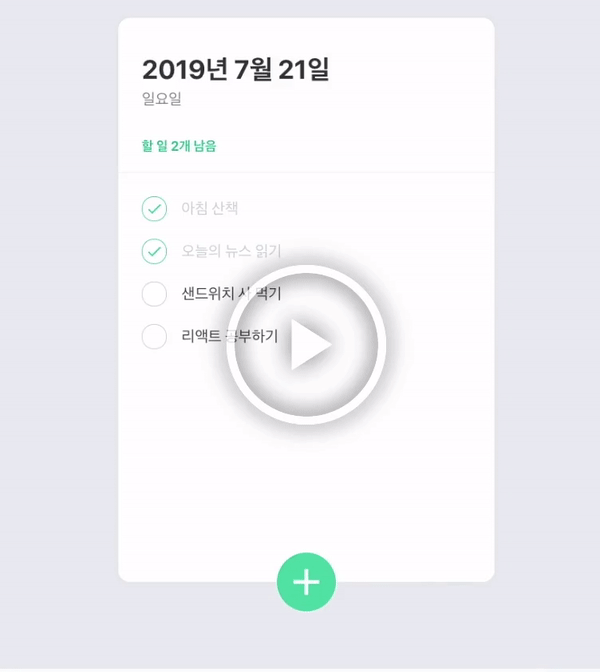

# toDoList
[velopert님](https://velopert.com/)의 <벨로퍼트와 함께하는 모던 리액트: 멋짓 투두리스트 만들기> 강좌의 todolist를 클론코딩 하였습니다.<br>
Typescript(Vanila-js)를 이용하여 제작되었으며, 타 라이브러리(jQuery, React, Vue, Angular)는 사용되지 않았습니다.<br>
HTML, CSS, Typescript(js)가 사용되었습니다.
<br/><br/>
[]()
[]()
[]()
[]()


## Intro

### Aim
</img>
</br>

### Using Method
[]()
[]()
1.  git clone this repositary
```code
git clone https://github.com/ss-won/todolist.git
```
2. npm 프로젝트 파일 build
```bash
npm install
npm run build
```
3. 실행
```bash
npm start
```
4. http://127.0.0.1:8080 접속

### Composition
* 기능
    * todolist 추가하기
    * todolist 삭제하기
    * 끝낸일 체크하기
    * 남은일 표시하기
    * 현재 날짜 표기하기
    * list추가창 버튼으로 열기/닫기
    * list 클릭되었을때 삭제버튼 보이기
    <br>

* UI Component
    * 날짜칸(yyyy-mm-dd)
    * 요일칸(월-일)
    * 남은할일 표시
    * 할일 리스트 요소(체크박스)
        * 체크박스
        * 할일 명칭(라벨)
        * 삭제 버튼(svn 객체)
    * 추가 버튼(toggle 기능)
        * 할일 작성 폼(input)
    <br>

### Review
* 프로젝트를 통해 배운 것 OR 성과
    * 성과
        * 타 라이브러리 사용없이, TypeScript(vanila-js) 만으로 모든 기능을 구현
        * SVG 파일 타 라이브러리 없이 적용하고 사용
    * 배운점
        * TypeScript의 DOM Manipulation(Ref: _lib.  dom.d.ts_)
        * JavaScirpt type=module의 작동 방식
        * HTMLElement 요소의 배치 구성 방법(style,  display 속성)
    
* 개발일지
    * [ver1](https://github.com/ss-won/todolist/tree/ver1.3/diary)
    * [ver2](https://github.com/ss-won/todolist/blob/ver2.0/diary)
    * [ver3](https://github.com/ss-won/todolist/blob/ver3.1/diary)
    * [ver4](https://github.com/ss-won/todolist/blob/ver4.1/diary)
    * [ver5](https://github.com/ss-won/todolist/blob/ver5.2/diary)
    * [ver6](https://github.com/ss-won/todolist/blob/ver6.0/diary)
    
    * [개발나부랭이블로그](https://blog.naver.com/PostList.nhn?blogId=j_wish_&from=postList&categoryNo=6)
   
