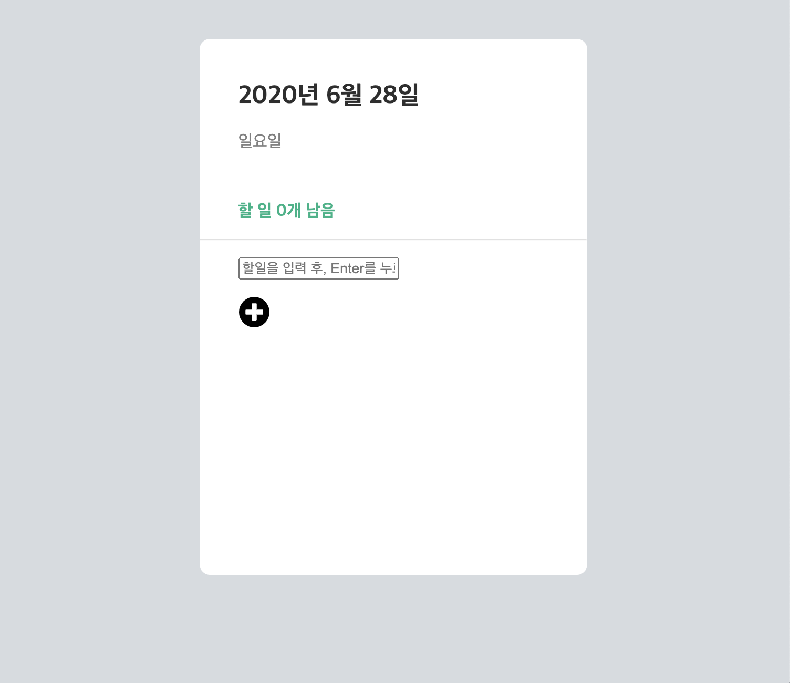

# 개_발_일_지
## 주요 변경사항[ver4.0]
</img> 

* 날짜 및 요일 창과 할일 리스트 간 사이 구분선 추가
* 주요 UI 여백 수정
    * 휴지통 버튼 absolute 형태로 변경 -> 사이트 크기와 상관없이 일정한 자리 유지
    * 할일 리스트(li) padding 조정을 통해 사이 거리 조절
* 체크박스 디자인 수정

### 지난 ver 개발일지 보러가기
* [ver1](https://github.com/ss-won/todolist/tree/ver1.3/diary) - 2020/5/13 개발일지
* [ver2](https://github.com/ss-won/todolist/blob/ver2.0/diary) - 2020/5/20 ~ 2020/6/4 개발일지
* [ver3](https://github.com/ss-won/todolist/tree/ver3.1/diary) - 2020/6/5 개발일지

## 현재까지 작동하는 기능
* todolist에 할일을 입력 [add](https://github.com/ss-won/todolist/blob/ver2.0/js/add.js)
* todolist에 현재 남은 할일(check되지 않은 할일) 표시 [checkit](https://github.com/ss-won/todolist/blob/ver2.0/js/check.js)
* todolist에서 할일을 삭제 [remove](https://github.com/ss-won/todolist/blob/ver2.0/js/rm.js)
* todolist에서 할일을 삭제 한 후 남은 리스트의 index값 수정 [update](https://github.com/ss-won/todolist/blob/ver2.0/js/rm.js)
* todolist 입력창을 생성 또는 삭제함 [toggle](https://github.com/ss-won/todolist/blob/ver2.0/js/toggle.js) 
* todolist 삭제버튼이 리스트에 접근할때만 보이게 하는 기능 [add](https://github.com/ss-won/todolist/blob/ver2.0/js/add.js)

## 개선사항 OR 추가할 사항
* SVG 애니메이션 작업
    * 추가버튼 누르면 -> 30도회전 후 빨간색으로 색 변환
    * submit이벤트가 발생하면 -> -30도 회전 후 기존 색으로 재변환
* 기타 CSS작업
    * 할일리스트 오는 자리 스크롤 달기
    * subbox[id: tail]부분 세부 수정

## 추후 더 공부해야 할 부분(이 코드는 Whyrano...)
* html의 <script>의 type 속성값 text/javascript 와 module의 차이는 무엇인가?
* Typescript에서 `<HTMLInputElement>`의 기능은 무엇인가?
* svg파일과 img파일의 차이, svg파일 인라인화 하는 방법

## Reference
*  웹에서 svg 사용하기 실습가이드 <https://svgontheweb.com/ko/>
*  체크박스 CSS 변경하기 <https://webdir.tistory.com/433>
