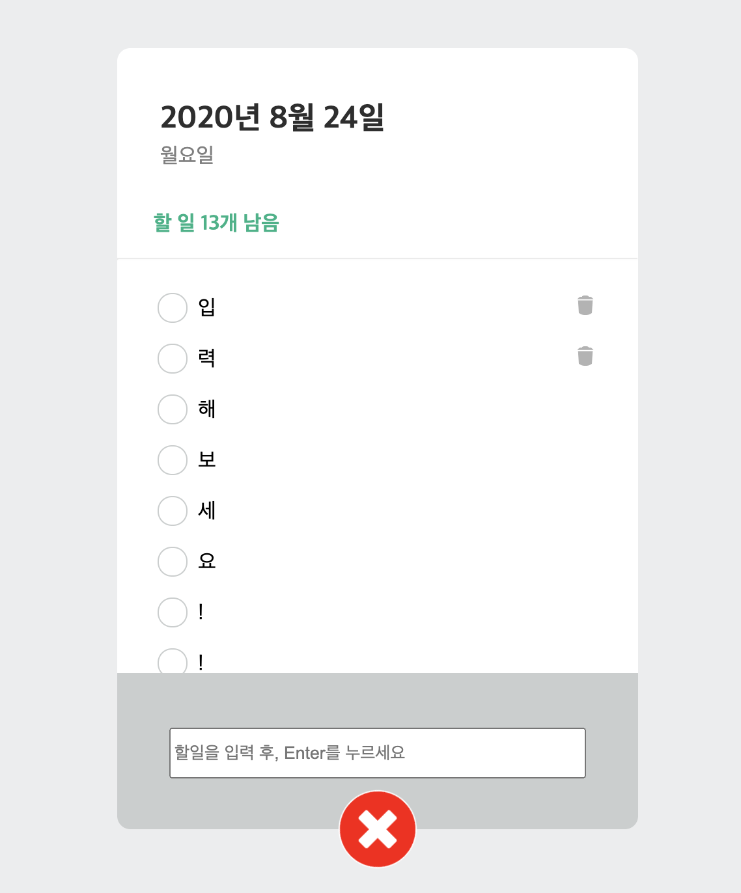

# 개_발_일_지
## 주요 변경사항[ver6.0]
</img> 

* `
` 요소 전체적인 내부 크기 및 여백 조절
* 반응형 페이지를 제작을 위해 media query 적용
* `<ui>` 요소의 margin값을 조정하여, 내부 스크롤 활성화 시 내용이 깨지는 버그 해결
* toggle.js에 토글버튼 누를때마다 속성값 변하도록 하는 함수 작성(animate, animateReverse)
* local에서 html 실행 시 module js를 읽어오지 못하는 것을 해소하기 위해, npm화 및 http-server 적용 구문 작성(package.json)
* 코드 내부 `<HTMLElement>`요소 `as HTMLElement`로 수정

### 지난 ver 개발일지 보러가기
* [ver1](https://github.com/ss-won/todolist/tree/ver1.3/diary) : 2020/5/13 개발일지
* [ver2](https://github.com/ss-won/todolist/blob/ver2.0/diary) : 2020/5/20 ~ 2020/6/4 개발일지
* [ver3](https://github.com/ss-won/todolist/tree/ver3.1/diary) : ~ 2020/6/5 개발일지
* [ver4](https://github.com/ss-won/todolist/tree/ver4.1/diary) : ~ 2020/6/27 개발일지
* [ver5](https://github.com/ss-won/todolist/tree/ver5.2/diary) : ~ 2020/8/24 개발일지

## 현재까지 작동하는 기능
* todolist에 할일을 입력 [add](https://github.com/ss-won/todolist/blob/ver2.0/js/add.js)
* todolist에 현재 남은 할일(check되지 않은 할일) 표시 [checkit](https://github.com/ss-won/todolist/blob/ver2.0/js/check.js)
* todolist에서 할일을 삭제 [remove](https://github.com/ss-won/todolist/blob/ver2.0/js/rm.js)
* todolist에서 할일을 삭제 한 후 남은 리스트의 index값 수정 [update](https://github.com/ss-won/todolist/blob/ver2.0/js/rm.js)
* todolist 입력창을 생성 또는 삭제함 [toggle](https://github.com/ss-won/todolist/blob/ver2.0/js/toggle.js) 
* todolist 삭제버튼이 리스트에 접근할때만 보이게 하는 기능 [add](https://github.com/ss-won/todolist/blob/ver2.0/js/add.js)

## 개선사항 OR 추가할 사항
> 현재까지는 없으나, 버그가 발생되거나 DB연결을 시도할 때 재작성될 수 있습니다. 🙇🏻‍♀️

## 추후 더 공부해야 할 부분
* html의 <script>의 type 속성값 text/javascript 와 module의 차이는 무엇인가?
* Typescript에서 `<HTMLInputElement>`의 기능은 무엇인가?
* svg파일과 img파일의 차이, svg파일 인라인화 하는 방법
* 뷰포트란 무엇인가?
* Typescript의 제네릭

## Reference
*  웹에서 svg 사용하기 실습가이드 <https://svgontheweb.com/ko/>
*  체크박스 CSS 변경하기 <https://webdir.tistory.com/433>
*  [css] position (static, relative, absolute, fixed) 의 속성 <https://electronic-moongchi.tistory.com/26>
*   overflow 속성 <https://aboooks.tistory.com/84>
* 반응형 웹디자인 만들기<https://jw910911.tistory.com/24>
